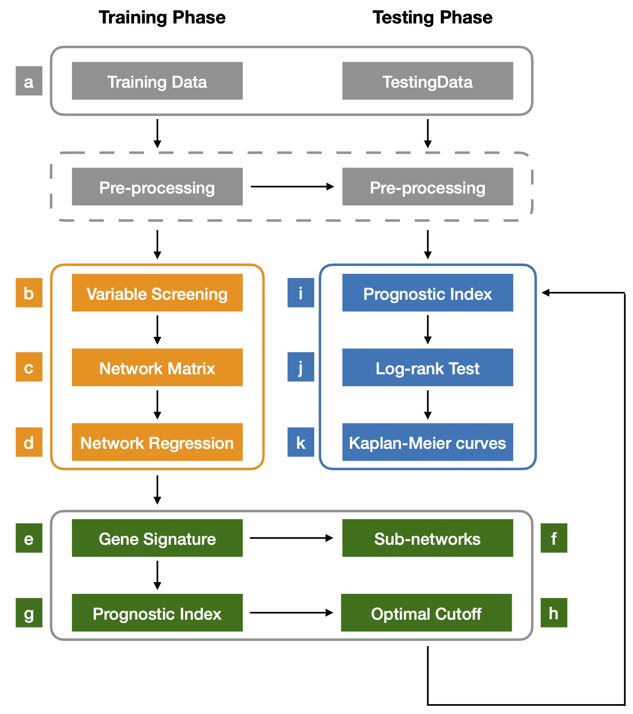
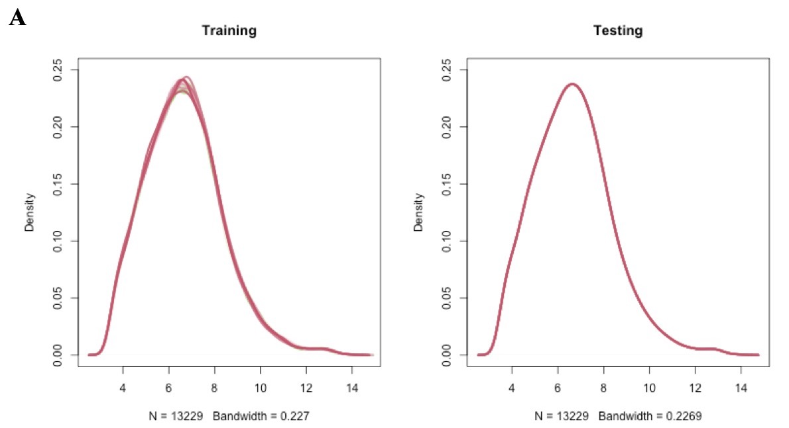
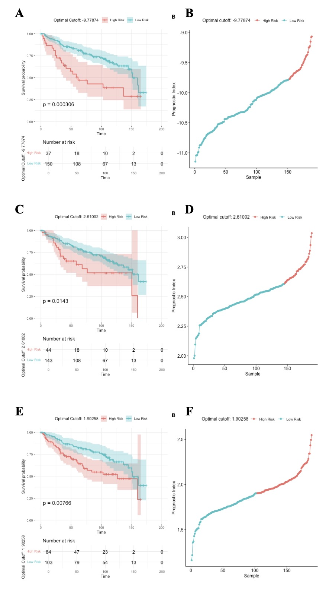
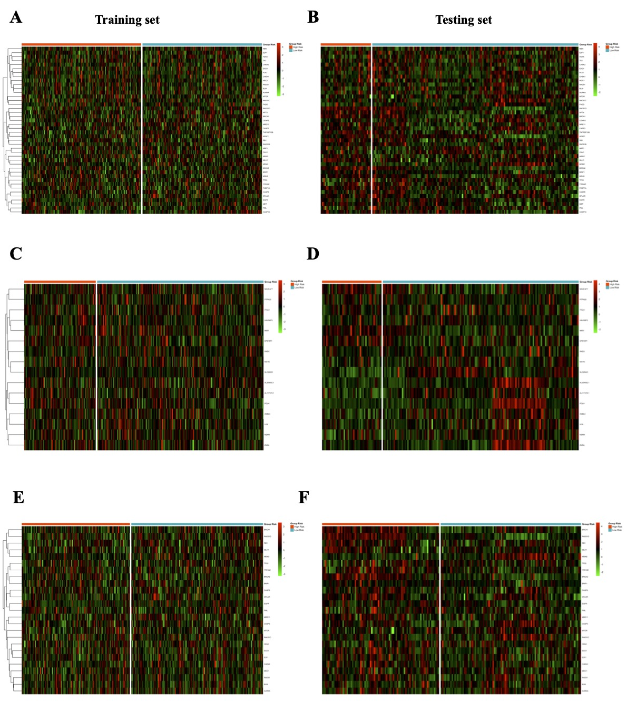

```{r style, echo = FALSE, results = 'asis'}
BiocStyle::markdown(css.files = c('my.css'))
```

# Introduction {.unnumbered}

```{r echo=FALSE, out.width = '100%', fig.align="center"}

```

This tutorial is a guide on how to run and use the `COSMONET R package`. The package implements a novel multistage computational-statistical procedure combining *screening techniques* and *network Cox regression methods* able to identify prognostic gene signatures and predict patient survival outcome ([Iuliano et al., 2018](https://www.frontiersin.org/articles/10.3389/fgene.2018.00206/full)). 
<!-- The package uses the Cox-regression model, which is a well known model for describing the relationship between patient survival times and predictor variables. --> In particular, `COSMONET package` implements the following main steps: 

* **screening approaches** to reduce the initial dimension of the data from an high-dimensional feature space to a moderate scale;
* **network-penalized Cox-regression methods** to model observed survival times through genome-wide omic profiles while accounting for coordinated functioning of genes in the form of biological networks;
* **survival analysis** to evaluate prognostic variables in cancer patients by using Kaplan-Meier curves;
* **network analysis** to show the new potential genes and pathways involved in the progression of cancer.

# Workflow of `COSMONET` package {.unnumbered}

```{r echo=FALSE, out.width = '100%', fig.align="center", fig.cap='Worflow of `COSMONET` package'}

```

${\bf a.}$ A training $T$ and a testing $D$ sets are given as input data. Normalization *within* each set and *between* the two sets are performed. 
 
  * The pre-processing is executed by the users and it consists of two steps:
  
      1. the *within normalization* depends on the type of platform used (for example, microarray or RNASeq data);
      2. the *between normalization* is included in our package. This step is necessary to make the two datasets comparable between them. 

Note that if the dataset is unique, it is at first randomly divided in a training set and a testing set and, then, they are normalized (step 2).
    
${\bf b.}$ *Screening techniques* on the training set are performed to reduce the dimension of the variable space from a large scale $p$ to a moderate scale $d < p$ where $d$ sre the screened variables. BMD, DAD or BMD+DAD-screening can be used for such purpose. 

${\bf c.}$ *Network matrix* is computed in order to incorporate *a-priori biological knowledge* in the model. This matrix is generally built by the users as an adjacency matrix with zero diagonal and non-negative off-diagonal.

${\bf d.}$ *Network-based Cox regression method* is applied on the screened subset $\mathcal{I}$ obtained in step (${\bf b}$).

${\bf e.}$ The *signature genes*, i.e., variables with regression coefficients $\hat{\boldsymbol{\beta}}_{\mathcal{I}} \neq {\boldsymbol{0}}_{\mathcal{I}}$ are selected.

${\bf f.}$ *Pathway sub-networks* based on gene signatures are shown. 

${\bf g.}$ The prognostic index $PI_T=\boldsymbol{X}_T \hat{\boldsymbol{\beta}}_{\mathcal{I}}$ is computed for each patient in the training set $T$.

${\bf h.}$ The optimal cutoff $PI^{*,T}$ is selected adaptively on the training set $T$.

${\bf i.}$ The prognostic index $PI_D=\boldsymbol{X}_D \hat{\boldsymbol{\beta}}_{\mathcal{I}}$ is computed on the testing set $D$. Then, each patient in $D$ is assigned into the high/low-risk group if its prognostic index $PI_D$ is above (or below) the optimal cutoff $PI^{*,T}$. 

${\bf j.}$ The *log-rank test* is performed to compare the two survival curves defined in step (${\bf i}$). 

${\bf k.}$ *Kaplan-Meier curves* are plotted.
 
For more datails see Section 2.4 in [Iuliano et al., 2018](https://www.frontiersin.org/articles/10.3389/fgene.2018.00206/full).

## `COSMONET` package {.unnumbered}

`COSMONET` is a new R package for survival analysis implementing the *screening-network methods* proposed in [Iuliano et al., 2018](https://www.frontiersin.org/articles/10.3389/fgene.2018.00206/full). 

Denote by $\{(Y_i,\delta_i, X_i), i=1, \ldots, n\}$ the observed survival data. Here, $Y_i$ is the response variable that indicates the survival time for patient $i$, $\delta_i$ is an indicator of whether patient $i$ has observed the event ($\delta_i=1$) or not ($\delta_i=0$) and $X_i=(x_{i_1}, \ldots, x_{i_p})^T$, for $i=1, \ldots, n$ is the omic profile of $n$ patients over $p$ genes. The package allows to apply:

1. **Screening Techniques** to reduce the feature space $p$ to a moderate scale $d$, i.e., $d<p$, by using the training set $T$ through three different screening scenarios:

    * **BioMedical-driven screening (BMD)**;
    * **Data-Driven screening (DAD)**;
    * **BMD- and DAD-screening (BMD+DAD)**.

We define the set $\{x_j, j \in \mathcal{I}\}$ as the subset of the screened variables and $d = |\{x_j, j \in \mathcal{I}\}|$ as its cardinality.
   
2. **Network-based Cox-regression methods** to select potential biomarkers (i.e., *signature genes*) on $T$ and to compute patient prognostic indexes $PI_i=\boldsymbol{X^T}_i \hat{\boldsymbol{\beta}}_{\mathcal{I}}$, with $i \in T$ and $\hat{\boldsymbol{\beta}}_{\mathcal{I}}$ the regression coefficients estimate on $T$. 

3. **Patient survival prediction** on a test set $D$ by evaluating the prognostic index $PI^D_i$, $i \in D$. The significance is assessed using *log-rank test*. Kaplan-Meier curves based on high-and low-risk groups (i.e., poor survival and high survival) are shown.

4. **Pathways analysis** is performed by considering the subset of the screened variables $\{x_j, j \in \mathcal{I}\}$ to identify potential biomarkers and relative pathways that can predict prognosis and survival.

Note that `COSMONET` provides a number of graphical functions for visualizing survival curves, gene signature, sub-network, heatmap and many other. 

`COSMONET` depends on different R packages such as `r CRANpkg("APML0")`, `r CRANpkg("survival")`, `r CRANpkg("ggpurb")`, `r CRANpkg("igraph")`, `r CRANpkg("pheamap")`. The package is available from <https://github.com/cosmonet-package/COSMONET.git>.

## Installation {.unnumbered}

`COSMONET` can be installed through the following commands in the R console:

```{r echo=TRUE, message=FALSE, warning=FALSE}
# install.packages("devtools")
# devtools::install_github("cosmonet-package/COSMONET", repos=BiocManager::repositories())
```

# Using `COSMONET` to investigate cancer data {.unnumbered}

The aim of this section is to provide the users with a general view of the package, including the main functions, and to describe the package's outputs. First, we upload the `COSMONET` R package by using the following command:

```{r echo=TRUE, message=FALSE, warning=FALSE}
# library(COSMONET)
```

For illustration purposes, we use two examples of cancer data that are included in our package. The data processed by `COSMONET` are microarray from [GEO](https://www.ncbi.nlm.nih.gov/geo/) database and RNA-seq data from [GDC data portal](https://gdc.cancer.gov). The aim of the study is to identify the genes and pathways that play a crucial role in the severity of the disease related to the survival of breast cancer patients.

Users can either load their own data or use those available from `COSMONET` R package.

## Example 1 {.unnumbered}

For microarray data, we consider expression measurements of two different breast cancer datasets from [GEO](https://www.ncbi.nlm.nih.gov/geo/) database: 
 * [GSE2034](https://www.ncbi.nlm.nih.gov/geo/query/acc.cgi?acc=gse2034) dataset as training set (Affymetrix Human Genome U133A Array);
 * [GSE2990](https://www.ncbi.nlm.nih.gov/geo/query/acc.cgi) dataset as testing set  (Affymetrix Human Genome U133A Array). 
 
`RMA` (Robust Multichip Average) function from `r Biocpkg("affy")` R package for *within arrays normalization* and `normalizeBetweenArrays` function from `r Biocpkg("limma")` R package for *between arrays normalization* are used for the normalization of each single dataset. The annotation is made by using `r Biocpkg("biomart")` R package after removing redundant probe sets, i.e. probe sets that measure different regions of the same gene. Generally, the pre-processing of the data are done by the users. The summary data is showed in the table below:

| GEO Accession | Platform | Nr. of genes | Nr. of samples | Survival data        |
|:-------------:|:---------:|:------------:|:--------------:|:-------------:|
| GSE2034       | Affymetrix HG-U133A | 13229                                               | 286           | Relapse Free Survival (RFS)|
| GSE2990       | Affymetrix HG-U133A | 13229                                               | 189           |  Relapse Free Survival (RFS)

* **Training set (T)**: GSE2034 - Gene expression profiles from total RNA of frozen tumour samples from 286 lymph-node-negative breast cancer patients [Wang Y, Klijn JG, Zhang Y, Sieuwerts AM et al., (2005)](https://pubmed.ncbi.nlm.nih.gov/15721472/).
* **Testing set (D)**: GSE2990 - Gene expression profiles of 189 invasive breast carcinomas [Sotiriou C, Wirapati P, Loi S, Harris A et al., (2006)](https://pubmed.ncbi.nlm.nih.gov/16478745/).

The datasets and the survival information are deposited in the GEO database (training set: [GSE2034](https://www.ncbi.nlm.nih.gov/geo/geo2r/?acc=GSE2034), testing set: [GSE2990](https://www.ncbi.nlm.nih.gov/geo/geo2r/?acc=GSE2990).

In this study, the survival information is *relapse-free survival*, i.e., the length of time after primary treatment for a cancer ends that the patient survives without any signs or symptoms of that cancer. In other words, measure the relapse-free survival means to see how well a new treatment works. Also called DFS *disease-free survival*, and RFS.

To investigate the datasets, we first load the data in an R session and then, we perform the *normalization between* the training and testing set by using `NormalizeBetweenData()` function. This step is mandatory to make sure that train and test sets have the same distribution (or shape) across sample (see for instance, Figure 1, Step ${\bf a.}$ and Figure 2A). Users should download these data and place them in your `/data` directory at the [link](add link).

```{r echo=TRUE, message=FALSE, warning=FALSE}
## Load data from our package
# load("data/BreastGEOData.RData")
# x1 <- as.matrix(TrainingData[,-c(1:5)])
# rownames(x1) <- TrainingData$external_gene_name
# x2 <- as.matrix(TestingData[,-c(1:5)])
# rownames(x2) <- TestingData$external_gene_name

## Survival information: RFS - time (months) and status (alive=0 or death=1)
# y1 <- SurvTrainingData[,-1]
# rownames(y1) <- SurvTrainingData$sample
# y2  <- SurvTestingData[,-1]
# rownames(y2) <- SurvTestingData$sample

### Median of survival time and censoring proportion
# median(y1$time)
# (length(which(y1$status==0))/dim(x1)[2])*100
# median(y2$time)
# (length(which(y2$status==0))/dim(x2)[2])*100

## (a) Normalization between datasets
# BetweenNormData <- NormalizeBetweenData(
#     as.matrix(x1),
#     as.matrix(x2),
#     norm.method="quantile",
#     plot=TRUE
# )

# x1.norm <- BetweenNormData$x1.norm
# dim(x1.norm)
# x2.norm <- BetweenNormData$x2.norm
# dim(x2.norm)
```

```{r echo=FALSE, out.width = '100%', fig.cap='Density plot', fig.align="center"}

```

### Functional Linkage Matrix and Co-Expression Matrix {.unnumbered}

To incorporate the *a-priori biological information* in the penalized regression model, we first need to build the network matrix, i.e., a weighted and undirected graph where each element represents the probability of how strong is the relationship between two adjacent genes. This network generally describes relation among molecules, such as protein-protein interaction, gene co-expression, functional similarities, regulatory relations or biochemical reactions. 
In our analysis to construct the molecular network we used`CreateNetworkMatrix()` function which implements the following steps:

1. the associated disease-genes (generally collected by the user) are explored in order to identify a subset of genes with cardinality $|\mathcal{I}|=d\leq p$;
2. the *Functional Linkage Matrix* $FL=(F_{ij})_{(i,j) \in \mathcal{I}}$ is build by using the genes selected in step (1);
3. the network matrix is completed by adding zero weights for all the genes that have no apparently association with the disease, i.e. a $p \times p$ matrix. We called this matrix *Omega*.

For our examples we considered a set of disease-genes covered by [HumanBase tool](https://hb.flatironinstitute.org) which contains a data-driven integrative analyses of specific cell types/tissues and human disease. 
In particular, we first select the top 500 genes (i.e., the genes with the highest posterior probabilities) associated with cancer disease [Disease Ontology](https://disease-ontology.org) ([DOID:1612](https://disease-ontology.org/term/DOID%3A1612/) which uses biological information contained in `repositoryDisease` file. This repository is a tab-delimited text file available in our package and contains the [DOID](https://disease-ontology.org) code and the prediction score, i.e., a posterior probability, associated to each gene. The higher the probability the stronger the functional relation between the gene and the disease.

```{r echo=TRUE, message=FALSE, warning=FALSE}
## Create the network matrix 
# load("data/tissueSpecificEdgeBreast.rda")
# NetworkMatrix <- CreateNetworkMatrix(
#   x1.norm,
#   repositoryDisease,
#   diseaseID = "DOID:1612",
#   topGenes = 500,
#   tissueSpecificEdge,
#   output = TRUE,
#   message = TRUE
# )
```

A simple way of generating a *Co-Expression Matrix* is also through the *correlation*, i.e., correlating all pairs of variables (genes) in a correlation matrix. Another possibility to create an *a-priori network* is to use [`STRINGdb package`](http://www.bioconductor.org/packages/release/bioc/html/STRINGdb.html) which provides a R interface to the [STRING](http://www.string-db.org) protein-protein interactions database.

### Variable screenings for Cox model {.unnumbered}

1. **Biomedical-Driven Screening (BMD-screening)**. In this type of screening, we identify the subset of the screened variables $\{x_j, j \in I\}$ by using only the biological information. Typically, this knowledge either derives from the literature (protein-protein interaction, pathway information, etc.) or is collected by users (for example a subset of disease-genes involved in a specific tumor). For our example, we considered as *screened genes* the top 500 genes associated with cancer disease obtained from the previous step. `ScreeningMethod()` function is applied (Figure 1, step ${\bf b}$).

```{r echo=TRUE, message=FALSE, warning=FALSE}
## (b) BMD-screened genes
# cancer.genes <- NetworkMatrix$DiseaseGenes[,2]
# screenVars.BMD <- ScreeningMethod(
#   x1.norm,
#   cancer.genes,
#   screening="bmd",
#   ranking=NULL,
#   thresh=NULL
# )
```

2. **Data-Driven Screening (DAD-screening)**. In this type of screening, we identify the subset of the screened variables $\{x_j, j \in I\}$ by reducing the feature space from a large scale dimension $p$ to a relatively moderate scale $d < p$ by using only information from the data. We apply `MarginalCoxRanking()` function to identify the candidate genes that are highly-correlated with the patient survival according to their corresponding Cox marginal utilities (Figure 1, step ${\bf b}$). The genes are ordered from the largest to the smallest [Fan et al., 2010](https://fan.princeton.edu/papers/10/IMSCOLL606-1.pdf), [Saldana and Yang, 2018](https://www.jstatsoft.org/article/view/v083i02). This function returns a data frame composed by the ranking of genes that are highly-correlated with the patient survival (`original.index` and `symbol`), the marginal regression coefficients (`marg.coeff`), the coefficients (`beta`) and the related $p$-values.

```{r echo=TRUE, message=FALSE, warning=FALSE}
### Ranking of genes that are highly correlated with the patient survival 
# rankingGenes <- MarginalCoxRanking(x1.norm,y1)
# head(rankingGenes)
# save(rankingGenes, file = "rankingGenes.RData")

# par(mfrow = c(1, 2))
# plot(rankingGenes$marg.coeff, rankingGenes$pvals, col = "blue", pch = 20)
# abline(h=0.05, col="red",lwd=2, lty=2)
# plot(rankingGenes$pvals, 1:diim(x1.norm)[2], col = "blue", pch = 20)
```

Then, in order to select the optimal threshold $d$ and optimize data prediction, we can choose to rank the genes:

   1. by `marginal regression coefficients`. We select the genes with $\vert \boldsymbol{\beta}_{\mathcal{I}} \vert > \delta_n$, where $\delta_n$ is a fixed threshold that indicates the $d'$ top ranked covariates;
   2. by `p.values`. We identify as $d'$-genes all the genes that have $p$-values $< 0.05$;
   3. by both `marginal regression coefficients` (1) and `p.values` (2).

We use `ScreeningMethod()` function to select as *screened genes* the top 2500 (`thresh`) genes ranked by marginal regression coefficients.

```{r echo=TRUE, message=FALSE, warning=FALSE}
## (b) DAD-screeened genes (the top 2500 ranking genes)
# screenVars.DAD <- ScreeningMethod(
#   x1.norm,
#   cancer.genes,
#   screening="dad",
#   ranking=rankingGenes,
#   thresh=200
#)
```

3. **Biomedical-Driven and Data-Driven Screening (BMD+DAD-screening)**. In this type of screening, we identify the subset of the *screened genes* $\{x_j, j \in I\}$ by merging the biomedical information (i.e., genes highly correlated to cancer disease) and the data-driven knowledge (i.e., the genes closely associated with the survival response). Hence, the resulting set of genes will be the union of the BMD and DAD sets of genes. `ScreeningMethod()` function is applied (Figure 1, step ${\bf b}$).

```{r echo=TRUE, message=FALSE, warning=FALSE}
## (b) Union of BMD- and DAD-screeened genes
# screenVars.BMD.DAD <- ScreeningMethod(
#   x1.norm,
#   cancer.genes,
#   screening="bmd+dad",
#   ranking=rankingGenes,
#   thresh=200
# )
```

By performing these variable screenings, by choosing one of the three DAD-ranking options illustrated in the previous section (case a, b or c), we aim to explore the best model that can sufficiently explain the data in the most parsimonious way in order to (i) make use of available information, (ii) identify new markers that the BMD-screening ignores, and (iii) improve the ability to make precise prognosis, diagnosis and treatments.

### Network-Regularized Cox Regression {.unnumbered}

The second step of our strategy is the application of penalized methods using the subset of screened variables $\{x_j, j \in I\}$ (where $I$ depends on the type screening performed) as new feature space. The existing relationships among the covariates can be described in terms of a weighted and undirected graph (network) where the vertices represent the genes and each edge indicates the weight between two adjacent vertices. In particular, the weight indicates the probability that two genes are functionally connected. Such information is incorporated in the analysis using the following penalty function:

$$P_{\lambda}(\boldsymbol{\beta}_{\mathcal{I}})=\lambda[\alpha\Vert\boldsymbol{\beta}_{\mathcal{I}}\Vert_1 + (1-\alpha)\Phi(\boldsymbol{\beta}_{\mathcal{I}})]$$
where $\lambda > 0$ (sparsity) and $\alpha \in (0, 1]$ (network influence) are two regularization parameters. The penalty function is composed by two terms. The first term is a $\ell_1$-norm, which induces sparsity into the solution; the second term $\Phi(\cdot)$ is a *Laplacian matrix* constraint, which gives smoothness among two adjacent coefficients in the network [Li et al., (2018)](https://www.ncbi.nlm.nih.gov/pmc/articles/PMC5768461/pdf/nihms914886.pdf).
The selected genes are identified by a gene signature vector, i.e., $\boldsymbol{\beta}_{\mathcal{I}}\neq 0$, that can be used to predict patients' survival. To assess the stability of the survival prediction we perform a five-fold cross-validation 10 times and we take as estimate the average value of $\lambda$.

`CosmonetTraining()` and `SelectOptimalCutoff()` functions are applied for the variable selection and the identification of the optimal cutoff $PI^{*,T}$, respectively (Figure 1, steps ${\bf (d)-(h)}$). 
  
```{r echo=TRUE, message=FALSE, warning=FALSE}
# (c) Network matrix
# Omega <- as.matrix(NetworkMatrix$Omega) 

## (d)-(h) Fit network-regularized Cox regression model and select optimal cutoff on training set  

### BMD-screening + Network-regularized Cox model
# fitTraining.BMD <- CosmonetTraining(
#   10,
#   x1.norm,
#   y1,
#   screenVars.BMD,
#   family="Cox",
#   penalty="Net",
#   alpha=0.5,
#   Omega=Omega,
#   nfolds=5
# )

# Regression coefficients
# beta.BMD <- fitTraining.BMD$beta
# sum(beta.BMD!=0)
# write.table(beta.BMD, "BMD_RegCoeff.txt", sep = "\t", row.names = TRUE, col.names = FALSE)

# Optimal lambda
# opt.lambda <- fitTraining.BMD$opt.lambda

# Data frame composed by samples, relative prognostic indices, times, status and group risk for each quantile
# df.train.BMD <- fitTraining.BMD$df
# head(df.train.BMD)

# Summary table 
# summary.BMD <- fitTraining.BMD$summary
# summary.BMD

#*****************************************************************************************************

### DAD-screening + Network-regularized Cox model
# fitTraining.DAD <- CosmonetTraining(
#   10,
#   x1.norm,
#   y1,
#   screenVars.DAD,
#   family="Cox",
#   penalty="Net",
#   alpha=0.5,
#   Omega=Omega,
#   nfolds=5
# )

# Regression coefficients
# beta.DAD <- fitTraining.DAD$beta
# sum(beta.BMD!=0)
# write.table(beta.DAD, "DAD_RegCoeff.txt", sep = "\t", row.names = TRUE, col.names = FALSE)

# Optimal lambda
# opt.lambda <- fitTraining.DAD$opt.lambda

# Data frame composed by samples, relative prognostic indices, times, status and group risk for each quantile
# df.train.DAD <- fitTraining.DAD$df
# head(df.train.DAD)

# Summary table 
# summary.DAD <- fitTraining.DAD$summary
# summary.DAD

#*****************************************************************************************************

### BMD+DAD-screening + Network-regularized Cox model
# fitTraining.BMD.DAD <- CosmonetTraining(
#   10,
#   x1.norm,
#   y1,
#   screenVars.BMD.DAD,
#   family="Cox",
#   penalty="Net",
#   alpha=0.5,
#   Omega=Omega,
#   nfolds=5
# )
# beta.BMD.DAD <- fitTraining.BMD.DAD$beta
# sum(beta.BMD.DAD!=0)
# write.table(beta.BMD.DAD, "BMD_DAD_RegCoeff.txt", sep = "\t", row.names = TRUE, col.names = FALSE)

# Regression coefficients
# beta.DAD <- fitTraining.DAD$beta
# sum(beta.BMD!=0)
# write.table(beta.DAD, "DAD_RegCoeff.txt", sep = "\t", row.names = TRUE, col.names = FALSE)

# Optimal lambda
# opt.lambda <- fitTraining.BMD.DAD$opt.lambda

# Data frame composed by samples, relative prognostic indices, times, status and group risk for each quantile
# df.train.BMD.DAD <- fitTraining.BMD.DAD$df
# head(df.train.BMD.DAD)

# Summary table
# summary.BMD.DAD <- fitTraining.BMD.DAD$summary
# summary.BMD.DAD
```

To summarize the results a data frame composed the percentage related to the cutoff (from 20% to 80%), the number of low- and high-risk group, the cutoff and the associated $p$-value (as result of the long-rank test) is shown.

### Survival analysis {.unnumbered}

Survival analysis is performed using the Kaplan Meier curves after dividing the patients of the testing set  $D$ in two risk groups (high- and low-risk groups) by using the optimtal cutoff $PI^{T*}$ and the *signature genes* estimated on $T$ (Figure 1, steps ${\bf (d)-(h)}$). The $p$-value is obtained as result of the log-rank test on the testing set $D$ (see for instance [Iuliano et al., 2018](https://www.frontiersin.org/articles/10.3389/fgene.2018.00206/full), section 2.4). See Figure 3 for more details.

`CosmonetTesting()` and `ValidationTest()` functions are used to validate the survival model (Figure 1, steps ${\bf (i)-(k)}$).

```{r echo=TRUE, message=FALSE, warning=FALSE}
## (i)-(k) Validation test

### BMD-screening 
# fitTesting.BMD <- CosmonetTesting(
#   x2.norm,
#   y2,
#   screenVars.BMD,
#   beta,
#   opt.cutoff
# )

# Data frame composed by samples, relative prognostic indices, times, status and group risk
# df.test.BMD <- fitTesting.BMD$df
# head(df.test.BMD)

#*****************************************************************************************************

### DAD-screening 
# fitTesting.DAD <- CosmonetTesting(
#   x2.norm,
#   y2,
#   screenVars.DAD,
#   beta.DAD,
#   opt.cutoff
# )

# Data frame composed by samples, relative prognostic indices, times, status and group risk
# df.test.DAD <- fitTesting.DAD$df
# head(df.test.DAD)

# fitTesting$p.value

#*****************************************************************************************************

### BMD+DAD-screening 
# fitTesting.BMD.DAD <- CosmonetTesting(
#   x2.norm,
#   y2,
#   screenVars.BMD.DAD,
#   beta.BMD.DAD,
#   opt.cutoff
# )

# Data frame composed by samples, relative prognostic indices, times, status and group risk
# df.test.BMD.DAD <- fitTesting.BMD.DAD$df
# head(df.test.BMD.DAD)

```

```{r echo=FALSE, out.width = '80%', fig.cap='Figure 3', fig.align="center"}
# 
```

### Venn diagram plotting {.unnumbered}

Venn Diagrams are plotted to show the relation between high- and low-risk group among the type of screening methods used.

```{r echo=TRUE, message=FALSE, warning=FALSE}
## Venn Diagram
# highRisk.BMD <- as.character(fitTesting.BMD$df$sample[which(fitTesting$df$groupRisk==1)])

# lowRisk.BMD <- as.character(fitTesting.BMD$df$sample[which(fitTesting$df$groupRisk==2)])

# highRisk.DAD <- as.character(fitTesting.DAD$df$sample[which(fitTesting$df$groupRisk==1)])
# lowRisk.DAD <- as.character(fitTesting.DAD$df$sample[which(fitTesting$df$groupRisk==2)])

# highRisk.BMD.DAD <- as.character(fitTesting.BMD.DAD$df$sample[which(fitTesting$df$groupRisk==1)])
# lowRisk.BMD.DAD <- as.character(fitTesting.BMD.DAD$df$sample[which(fitTesting$df$groupRisk==2)])

# library(VennDiagram)
## Helper function to display Venn diagram
# display_venn <- function(x, ...){
#   library(VennDiagram)
#   grid.newpage()
#   venn_object <- venn.diagram(x, filename = NULL, ...)
#   grid.draw(venn_object)
# }
## Chart
# display_venn(
#   x = list(highRisk.BMD, highRisk.DAD, highRisk.BMD.DAD),
#   category.names = c("HighRisk-BMD" , "HighRisk-DAD" , "HighRisk-BMD+DAD")
# 
#
# display_venn(
#   x = list(lowRisk.BMD, lowRisk.DAD, lowRisk.BMD.DAD),
#   category.names = c("LowRisk-BMD" , "LowRisk-DAD" , "LowRisk-BMD+DAD")
# )
```

### Heatmap visualization {.unnumbered}

To better understand the gene signature, the package includes a heatmap function to investigate the selected genes (with $\boldsymbol{\beta}_{\mathcal{I}}\neq 0$). We ordered survival patients according to the prognostic index $PI$ for each dataset (training and testing set) and divide them in two risk classes (i.e., low-risk and high-risk) using the optimal cut-off $PI^*$, as described in section 2.4 in [Iuliano et al., 2018](https://www.frontiersin.org/articles/10.3389/fgene.2018.00206/full). `HeatmapSurvGroup()` function is used to visualize the heatmap of the gene expression matrix on the training dataset $T$ and testing dataset $D$ by taking into account one of the screening-network method applied (Figure 1, steps ${\bf (i)-(k)}$).

```{r echo=TRUE, message=FALSE, warning=FALSE}
# PI.train <- fitTraining.BMD$df[,2]
# PI.test <- fitTesting.BMD$df[,2]
# heatmap <- HeatmapSurvGroup(
#   x1.norm, 
#   x2.norm, 
#   screenVars.BMD, 
#   beta.bmd, 
#   PI.train, 
#   opt.cutoff, 
#   PI.test, 
#   th=3.5
# )
# 
# ggsave("HeatmapBMD.png", width = 15, height = 5)
```

```{r echo=FALSE, out.width = '80%', fig.cap='Figure 4', fig.align="center"}
# 
```

Figure 4 shows the Z-score expression matrix of the BMD-genes in the training (T) and testing (D) by using microarray data (GSE2034 and GSE2990). The genes in the horizontal direction are clustered in the same order in both sets (T and D). Z-scores of the gene expression measurements are used. Z-scores larger than 3.5 were set to 3.5 and Z-scores smaller than -3.5 were set to -3.5. Red color indicates a high level of expression in breast cancer and green color indicates a low level of expression. The patients are divided in high-risk and low-risk groups (i.e., patients with bad and good prognosis).

### Pathway Analysis {.unnumbered}

`COSMONET` includes an RMarkdown script to generate an interactive dashboard of genes-pathways networks. The generated networks include all the genes selected by the network regression model ($\boldsymbol{\beta}_I\neq 0$) allowing the user to perform a KEGG-pathways analysis, as described in [Iuliano et al., 2018](https://www.frontiersin.org/articles/10.3389/fgene.2018.00206/full). 

An example of the generated network running the proposed regression model on the GEO dataset with the DAD-screening is reported below. The dashboard contains two tabs, one for the not-isolated genes and one for the full network.

```{r echo=FALSE, out.width = '100%', fig.align="center"}
# knitr::include_graphics("fig5.jpg")
```

Each node corresponds to a gene and the edges represent the KEGG pathways shared by the linked genes. Different node colors are used to show a correlation measure between the genes and the disease under investigation as follows:

* Orange nodes represent the top 500 tissue-specific genes according to the [HumanBase tool](https://hb.460flatironinstitute.org/download) (mapped up genes);
* Green nodes represent the bottom 501 tissue-specific genes according to the HumanBase tool (mapped down genes);
* Purple nodes represent the genes that have not been yet identified as tissue-specific in the HumanBase database (not mapped genes).

Therefore, orange nodes represent the BMD contribution to the signature and green and purple nodes the DAD contribution, not yet captured in the BMD list. Note that some of the genes colored in orange might also be retrieved from the data under analysis (as DAD-genes). However, in this context, we want to underline and make sense of the novel information not yet considered. The red-framed nodes represent genes that have been cited in the literature as cancer disease-associated genes according to the [Cancer Genetics Web Database](http://www.cancer-genetics.org). The number of papers citing the genes is displayed when hovering with the mouse over the node. 

We implemented the `GenerateNetwork()` function to visualize the interactive networks. The colours of the nodes and the ID of the disease to investigate can be changed by the user passing the new values as function's parameters.

```{r echo=TRUE, message=FALSE, warning=FALSE}
# GenerateNetwork(
#   ListOfGenes = "listOfGenes.txt", 
#   header = TRUE, 
#   diseaseID = "DOID:1612", 
#   nodesCols = c('#ffd9b3', '#d7fcb5', '#e4b5fc')
#)
```

The `GenerateNetwork()` function can also be used as a standalone tool to create a KEGG pathways network using an external list of genes provided by the user. 

## Example 2 {.unnumbered}

For RNASeq data we consider TCGA-LAUD (Lung adenocarcinoma) data from the [GDC Data Portal](https://portal.gdc.cancer.gov/). The [data](http://www.linkedomics.org/data_download/TCGA-LAUD/]) are pre-processed and normalized (Illumina HiSeq platform, Gene-level, RPKM).

To investigate the dataset, we first load the data into the R session [link](add link).

```{r echo=TRUE, message=FALSE, warning=FALSE}
## Load the data from the package
# load("data/TCGA_LAUD_RNASeqData.RData")
```

Then, we divided it in training set ($T$) and testing set ($D$) and applied the *between normalization* by using the functions `splitData()` and `NormalizeBetweenData()`, respectively. Note that we splitted randomly the data set into 50% train and 50% test (step ${\bf (a)}$).

The summary of the data is showed in the table below:

| GDC Accession | Platform       | Nr. of genes| Nr. of samples| Survival data   |
|:-------------:|:--------------:|:-----------:|:-------------:|:---------------:|
| TCGA-LAUD     | Illumina HiSeq | 19988       | 246          | Overall Survival|

```{r echo=TRUE, message=FALSE, warning=FALSE}
## (a) Split data in training and testing set
# splitData <- SplitData(CountData,0.50)
# x1 <- splitData$training
# x2 <- splitData$testing

## Survival information (time and status)
# y1 <- survival[match(rownames(x1),rownames(survival)),]
# y2 <- survival[match(rownames(x2),rownames(survival)),]

### Median of survival time in the training set
# median(y1$time)
# (length(which(y1$status==0))/dim(x1)[1])*100
# median(y2$time)
# (length(which(y2$status==0))/dim(x2)[1])*100

## (a) Normalization between datasets
# BetweenNormData <- NormalizeBetweenData(as.matrix(t(x1)),as.matrix(t(x2)),norm.method="quantile",plot=TRUE)
# x1.norm <- BetweenNormData$x1.norm
# dim(x1.norm)
# x2.norm <- BetweenNormData$x2.norm
# dim(x2.norm)
```

The density plots is plotted to control that the shape of training and testing set across patients is similar (see Figure 6).

```{r echo=FALSE, out.width = '100%', fig.cap='Figure 3', fig.align="center"}
# knitr::include_graphics("fig6.jpg")
```

# Conclusions {.unnumbered}

`COSMONET` is a powerful package that can be used to identify new cancer biomarkers through screening and Cox-network approaches. Here, we presented an example to show a simple application of the package. As reported in [Iuliano et al., 2018](https://www.frontiersin.org/articles/10.3389/fgene.2018.00206/full), the framework implemented in `COSMONET` provides many more advantages than the ones shown above. Among others: (i) the screening-network procedures outperforms classical penalized Cox-regression methods, allowing to select sub-network signatures, (ii) the DAD-screening has good performance in absence of any previous information but it is sub optimal with respect to the BMD-screening, and (iii) BMD+DAD screening improves both BMD and DAD the performance of `COSMONET`. These results may improve prediction accuracy and guide clinicians in choosing specific therapies for better survival and in avoiding unnecessary treatments.

# Session info {.unnumbered}


```{r echo=FALSE}
sessionInfo() 
```
